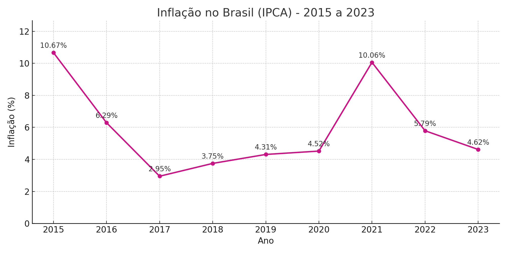

# 📊 Gráfico de Inflação no Brasil com Python

Este é um projeto simples feito em **Python** usando **Google Colab**, com dados representando o **IPCA (inflação oficial)** no Brasil de 2015 a 2023.

O objetivo foi:
- Visualizar a variação da inflação ano a ano
- Criar um gráfico de linha com `matplotlib`
- Aprender a manipular dados com `pandas`
- Exercitar o uso do Google Colab na prática

---

## 🔧 Tecnologias utilizadas
- Python 3
- Google Colab
- pandas
- matplotlib

---

## 📈 Gráfico final

---

## 💻 Como rodar o projeto
Você pode abrir o notebook direto no Google Colab clicando aqui:

🔗 [Abrir no Google Colab](https://colab.research.google.com/)

Ou baixar o arquivo `.ipynb` e abrir no Jupyter Notebook local.

---
